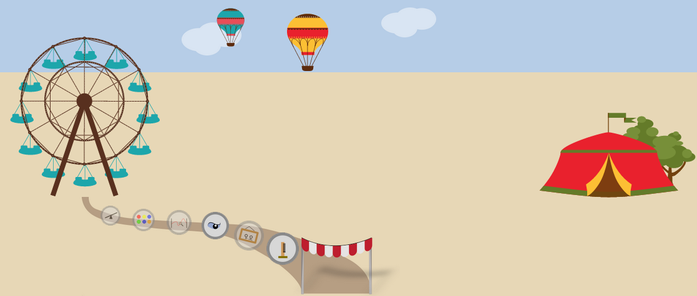
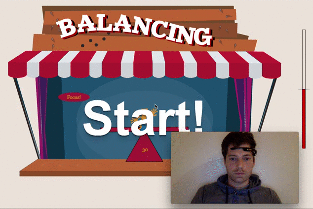
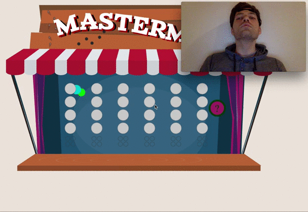
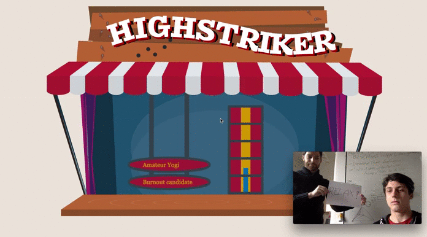

# Funfair: EEG-based game control
Funfair is a collection of six browswer games, all centered around the setting of a - very special - funfair. Unlike traditional games, controlled with a keyboard and/or a  mouse, all of our games can be played by **controlling one's mental activity**, measured by an [Emotiv Insight](https://www.emotiv.com/insight/) EEG device. EEG stands for electroencephalography, a method of recording electrical activity, also called "brain waves". If you always wanted to find out whether you can relax like a Yoga guru, win a battle against evil eyes coming closer and closer or find out how a painter would draw you if he knew your current mood, then there's only one thing left to do: start playing!



## Teaser

Here's how playing some of our funfair games looks like:

### Balancing game:


### Mastermind game:


### Highstriker game:


### 

## Setup

#### Tested setup:
* Mac OSX 10.12.2
* Linux (Ubuntu 16.04.2 LTS)

#### Dependencies:
* Python 2.7.12

All Python dependencies can be installed via:
```
pip install -r dependencies.txt
```
#### Optional dependencies:
* Leap Motion device


## Usage

### Directory organization

The organization of our git directory should be rather self-explanatory:

- **code:** Consists of one subdirectory per game and of app.py, which needs to be executed for starting the game (See Basic Usage)
- **design:** All the .svg, .png graphics and buttons
- **publications:** All project-related 'publications' (sorted chronologically), ranging from the early ideas up to the final report. 

### Basic Usage
Funfair consists of several submodules, each implementing exactly one game. You can start the main project with python:
```
python app.py
```
After that, the browser can be opened: http://localhost:8080 and you should be seeing a little funfair with baloons, a tent and the first game (highstriker) enabled. Make sure the Emotiv Insight device is switched on and paired, otherwise you'll find yourself having a hard time winning the game! As soon as one game is won, the next one is unlocked, until you make your way to the Ferris wheel (which is awaiting you with a little surprise if you win all games).


## Do-it-yourself: How to create a new game
If you'd like to create a similar game on your own, here's some brief information on how to do this: 

Our software consists of a Python application which forks a Tornado web-application server. This setup streams the sensor data from Emokit directly to the browser via websockets. On the browser side, the data are received asynchronously. The games themselves are organized in separate HTML files, which share one common JavaScript file. This JavaScript file handles the game progress and implements a central animation loop which can be used by every individual game.

Animations can be created by including `js/common.js`. The `example_animation.html` file gives a little overview of the functionality. In detail:

```
animate(name, callback[, time]);
stopAnimate(name);
```

Every animation needs a unique name identifiear that can be used to cancel it. If `time` is set, this must be a positive number (indicating the milliseconds to be run). The callback then has one argument, which holds a normalized position within the animation time in `[0, 1]`. 

The example file draws a circle within each callback. The screen is cleared every iteration, so it must always be redrawn. If the click-animation should be visible, then simply change the coordinates of an object, which is drawn within the main loop.


## Acknowledgement

The process of creating new paintings from a photograph according to a certain style is based on:

* [Image Style Transfer Using Convolutional Neural Networks](http://www.cv-foundation.org/openaccess/content_cvpr_2016/papers/Gatys_Image_Style_Transfer_CVPR_2016_paper.pdf)
by Leon A. Gatys, Alexander S. Ecker, and Matthias Bethge
* The [Deepart API](https://github.com/deepart-io/deepart-api)
* The [Turbo-Deepart website](http://turbo.deepart.io/)

This work was done as part of the computer games & visual effects / computer graphics course, offered by the [chair of Computer Graphics](http://www.uni-tuebingen.de/fakultaeten/mathematisch-naturwissenschaftliche-fakultaet/fachbereiche/informatik/lehrstuehle/computergrafik/lehrstuhl.html) (Hendrik Lensch), University of Tübingen; supervised by [Katharina Schwarz](http://www.wsi.uni-tuebingen.de/lehrstuehle/computergrafik/lehrstuhl/staff/katharina-schwarz.html) and [Patrick Wieschollek](http://www.wsi.uni-tuebingen.de/lehrstuehle/computergrafik/lehrstuhl/staff/wieschollek.html).
