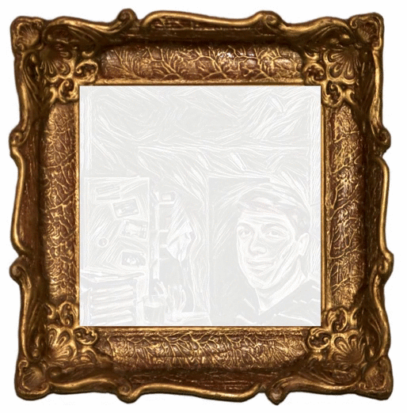

funfair project readme
====================

project description:
-----------------

Funfair: as he name suggests, funfair aims at having fun! The project consists of several games, all centered around the setting of a - very special - funfair. 

video:
--------
This shows a video.

GIT-policy:
--------------

**master**: always a clean working version

**develop**: latest working version that becomes 'master' at some point

**feature-branches**: used for developing specific features; will be merged into 'dev' upon completion

Modular structure:
------------------

Funfair consists of several submodules, each implementing exactly one game. Currently, "painter" is a game that is already playable (even though it's far from being perfect). In order to play this game, go to code/painter/ and open painter.html, e.g. via '$ firefox painter.html'. You should then see a picture frame containg the famous 'Lena' image. Use your mouse to draw.

Issues und Project - Tabs
-------------------------

Nutzt ruhig die Möglichkeit Issues und Meilensteine anzulegen. Plant damit neue Features und definiert Zwischenversionen. Durch Zuweisung von Issues (Aufgaben) könnt ihr euch die Arbeit teilen.

Mit dem "Project" - Tab habt ihr die Möglichkeit eine Kanban-Tafel anzulegen. Statt das Zeitmanagement und Projektmanagement auf Papier festzuhalten, werden wir eure Aktionen anhand der Meilensteine nachvollziehen.

Nun solltet ihr im nächsten Schritt diese README.md überschreiben und an euer Projekt (Titel und kurze Beschreibung) anpassen.
 
